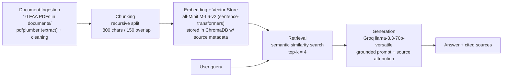

# Project 1 Planning: The Unofficial Guide

> Write this document before you write any pipeline code.
> Your spec and architecture diagram are what you'll use to direct AI tools (Claude, Copilot, etc.) to generate your implementation — the more specific they are, the more useful the generated code will be.
> Update the Retrieval Approach and Chunking Strategy sections if you change your approach during implementation.
> Update this file before starting any stretch features.

---

## Domain

**Becoming a Flight Instructor with a Sport Pilot rating (CFI-S) in the United States** —
and the knowledge such an instructor must hold and teach.

This knowledge is valuable but genuinely hard to find in one place. The official answers
exist, but they are scattered across federal regulations (14 CFR), separate FAA testing
standards (ACS/PTS), advisory circulars, and multi-hundred-page handbooks — each written
in dense, cross-referencing "FAA-ese." Answering a single practical question often means
knowing *which* document holds the answer: aeronautical-experience requirements live in
14 CFR Part 61, the checkride tasks live in the ACS/PTS, teaching theory lives in the
Aviation Instructor's Handbook, and endorsement wording lives in an Advisory Circular. A
prospective instructor has to triangulate across all of them. This system makes that
corpus searchable in plain language and returns grounded, cited answers.

---

## Documents

All sources are **public-domain U.S. Government / FAA publications** (downloaded from
faa.gov and govinfo.gov). 10 documents, 1,099 pages total. See `documents/SOURCES.md`
for full provenance notes.

| # | Source | Description | URL or location |
|---|--------|-------------|-----------------|
| 1 | 14 CFR Part 1 | Regulatory definitions ("sport pilot," "light-sport aircraft") and abbreviations | https://www.govinfo.gov/content/pkg/CFR-2024-title14-vol1/pdf/CFR-2024-title14-vol1-part1.pdf |
| 2 | 14 CFR Part 61 | Certification of pilots and flight/ground instructors — eligibility, experience, privileges, endorsements (core regulation) | https://www.govinfo.gov/content/pkg/CFR-2024-title14-vol2/pdf/CFR-2024-title14-vol2-part61.pdf |
| 3 | 14 CFR Part 91 | General operating and flight rules | https://www.govinfo.gov/content/pkg/CFR-2024-title14-vol2/pdf/CFR-2024-title14-vol2-part91.pdf |
| 4 | AC 61-65K | Advisory Circular: guidance + sample endorsement wording for pilots and instructors | https://www.faa.gov/documentLibrary/media/Advisory_Circular/AC_61-65K.pdf |
| 5 | FAA-G-ACS-2 | ACS Companion Guide for Pilots — how to read/use the ACS, references, acronyms | https://www.faa.gov/training_testing/testing/acs/acs_companion_guide_pilots.pdf |
| 6 | FAA-H-8083-2A | Risk Management Handbook (PAVE, IMSAFE, 5P frameworks) | https://www.faa.gov/sites/faa.gov/files/2022-06/risk_management_handbook_2A.pdf |
| 7 | FAA-H-8083-9A | Aviation Instructor's Handbook — learning theory, the teaching process, assessment | https://www.govinfo.gov/content/pkg/GOVPUB-TD4-PURL-LPS109875/pdf/GOVPUB-TD4-PURL-LPS109875.pdf |
| 8 | FAA-S-8081-29 | Sport Pilot & Sport Pilot Flight Instructor Practical Test Standards (most domain-specific) | https://www.faa.gov/sites/faa.gov/files/training_testing/testing/test_standards/faa-s-8081-29.pdf |
| 9 | FAA-S-ACS-25 | Flight Instructor (Airplane) Airman Certification Standards | https://www.faa.gov/training_testing/testing/acs/cfi_airplane_acs_25.pdf |
| 10 | FAA-S-ACS-6C | Private Pilot (Airplane) ACS — the standard an instructor trains students *to* | https://www.faa.gov/training_testing/testing/acs/private_airplane_acs_6.pdf |

The set is deliberately varied — regulations, testing standards, advisory guidance, and
handbooks — because different question types resolve to different document types.

---

## Chunking Strategy

**Chunk size:** ~800 characters (≈160 tokens)

**Overlap:** 150 characters

**Reasoning:**

My corpus mixes three structures: dense regulatory text with numbered subsections
(Parts 1/61/91), structured ACS/PTS task tables, and flowing handbook prose. I chose a
**recursive character split** that prefers natural boundaries — paragraph breaks first,
then sentence breaks, then spaces — so a chunk tends to end at a real boundary instead of
mid-sentence. That matters for regulations, where a single lettered subsection (e.g.,
§ 61.183) is a self-contained unit I want to keep together when possible.

The ~800-character target is driven by my embedding model: **all-MiniLM-L6-v2 truncates
input at 256 tokens (~1,000 characters)**. Sizing chunks at ~160 tokens keeps the entire
chunk *plus* any overlap inside that window, so nothing gets silently cut off — a real
risk if I used larger chunks. It's also large enough to hold a complete regulatory
thought or a paragraph of handbook prose, so a retrieved chunk is usually answerable on
its own.

The 150-character overlap (~19%) guards against a key fact landing on a chunk boundary —
e.g., a requirement whose condition is in one chunk and its exception in the next.

*Validation outcome (Milestone 3 — updated after implementation):* the pipeline produced
**5,629 chunks** (avg 711 chars), which exceeds the project's 50–2,000 guideline. I had
planned to fix an overage by raising chunk size toward ~1,000 chars, but on implementation
that doesn't work: ~1,000-char chunks still yield ~4,600 chunks, and going large enough to
reach 2,000 chunks (~2,200 chars) would blow past MiniLM's 256-token window and silently
truncate text. I therefore **kept ~800-char chunks and accept the higher count.** The
50–2,000 guideline is aimed at smaller, noisier corpora where a high count signals thin,
low-signal fragments; my chunks average 711 chars and are self-contained regulatory/handbook
units, so that failure mode doesn't apply, and 5,629 vectors is trivial for ChromaDB. The
real binding constraint on chunk *size* is the embedding window, not the chunk *count*.
(This is a deliberate divergence from the spec — noted here for the README spec reflection.)

I also verified the checkpoint: printed 5 random chunks (readable and self-contained),
confirmed 0 empty chunks and no leftover boilerplate (GovInfo `VerDate` footers, CFR running
headers, ACS/PTS page footers, rotated watermark text all removed). The biggest extraction
risk — the CFR and handbooks being **two-column**, which a naive `extract_text()` scrambles —
is handled by per-page column detection (see `ingest.py`).

---

## Retrieval Approach

**Embedding model:** all-MiniLM-L6-v2 (via `sentence-transformers`)

**Top-k:** 4

**Production tradeoff reflection:**

I'm starting with **all-MiniLM-L6-v2** because it runs locally with no API key or rate
limits, is fast to embed ~1,099 pages of text, and is a strong baseline for a first
system. Its constraints are a 256-token input window and 384-dimensional vectors — fine
for my ~800-char chunks. I'll retrieve **k = 4** chunks per query: enough context for
most questions without diluting the prompt with loosely-related material. I expect to
revisit k after seeing evaluation results, because some FAA answers legitimately span
multiple sections (a Part 61 rule plus its ACS task), which can argue for a higher k.

If I were deploying this for real users and cost weren't the constraint, I'd weigh:
- **Context length / accuracy:** a model with a longer input window (e.g., `bge-base`,
  or an API model like OpenAI `text-embedding-3-large`) would let me use larger chunks
  without truncation and generally retrieve more accurately on dense regulatory text.
- **Domain fit:** FAA text is jargon-heavy ("endorsement," "aeronautical experience,"
  type-rating language). I'd test whether a stronger general model, or one fine-tuned on
  technical/legal text, improves retrieval on my specific question set before paying for it.
- **Latency & operability:** a local model has predictable latency and no per-call cost
  or vendor dependency; an API model adds network latency and cost but offloads compute.
- **Multilingual support:** not a priority here (English-only FAA corpus), so I would not
  pay for a multilingual model for this domain.

---

## Evaluation Plan

> ✅ Verified by me: I opened each cited document and confirmed the expected answer matches
> what the source says. Q5 is intentionally designed to be a hard / likely-failure case.

| # | Question | Expected answer (confirmed against cited source ✅) |
|---|----------|-----------------------------------------------|
| 1 | What are the eligibility requirements to apply for a flight instructor certificate? | Per 14 CFR 61.183: be at least 18, able to read/speak/write/understand English, hold a commercial or ATP certificate, hold an instrument rating (for airplane/powered-lift), pass the required knowledge and practical tests, and receive the required training/endorsements. *(Confirmed in Part 61, § 61.183.)* |
| 2 | What are the privileges and limits of a sport pilot flight instructor's authorization? | Per 14 CFR 61.41x (Subpart K): a sport pilot CFI may give training toward a sport pilot certificate/privileges within the category/class they're authorized for, must hold the appropriate endorsements, and is limited to light-sport aircraft. *(Confirmed in Part 61 Subpart K, §§ 61.411–61.429, and FAA-S-8081-29.)* |
| 3 | What are the laws of learning described in the Aviation Instructor's Handbook, and what does the law of primacy mean? | The six laws: Readiness, Exercise, Effect, Primacy, Intensity, Recency. Primacy: what is learned first creates a strong, lasting impression, so it's important to teach correctly the first time and avoid "unteaching." *(Confirmed in FAA-H-8083-9A, learning-theory chapter.)* |
| 4 | What must an instructor do before endorsing a student for their first solo flight? | Per 14 CFR 61.87 and AC 61-65: the student must pass an instructor-administered presolo written test, receive and log training on the required maneuvers in the make/model, and the instructor must give the required logbook endorsements certifying readiness for solo. *(Confirmed in Part 61 § 61.87 and AC 61-65K endorsements section.)* |
| 5 | *(Hard / likely failure case)* Can a sport pilot flight instructor train a student toward a Private Pilot certificate? | Expected: No — a sport pilot CFI's training authorization is limited to sport pilot training; private-pilot training requires a regular flight instructor certificate. This question is designed to expose whether retrieval pulls the right subpart and whether the LLM over-generalizes. *(Confirmed against Part 61 Subpart K vs. Subpart H.)* |

---

## Anticipated Challenges

1. **Cross-document answers split across chunks/sources.** Many real questions require
   stitching a Part 61 rule together with its ACS task or an AC's endorsement wording. With
   k = 4 and ~800-char chunks, retrieval may surface only part of the answer, producing a
   partially-correct response. Mitigation: tune k and chunk size during evaluation, and
   verify which sources were retrieved for each test question.

2. **Near-duplicate / overlapping regulatory language confusing semantic search.** Part 61
   contains many similarly-worded subsections (sport pilot vs. private vs. instructor
   requirements). Semantic search may retrieve the *wrong* subpart that shares vocabulary
   with the query (this is exactly the trap in eval Q5). Mitigation: inspect distance scores
   and retrieved sources, and consider metadata filtering by document as a stretch feature.

3. **PDF extraction artifacts from tables and multi-column layouts.** ACS/PTS documents use
   tables and the handbooks use multi-column pages, which `pdfplumber` can extract in a
   jumbled reading order. Bad text in → bad chunks → bad retrieval. Mitigation: print and
   read sample extracted text per document before chunking; clean headers/footers/page
   numbers.

---

## Architecture

Pipeline stages and tools: **Ingestion** (pdfplumber) → **Chunking** (recursive
character splitter) → **Embedding + Vector Store** (all-MiniLM-L6-v2 + ChromaDB) →
**Retrieval** (top-k=4 semantic search) → **Generation** (Groq llama-3.3-70b-versatile,
grounded prompt with programmatic source citation).

---

## AI Tool Plan

> Draft plan — I'll refine as I go. The decisions in this spec are mine; I'm using AI to
> implement against them and will verify each output against the relevant section.

**Milestone 3 — Ingestion and chunking:**
I'll give Claude my *Documents* and *Chunking Strategy* sections plus the architecture
diagram, and ask it to implement (a) a loader that extracts text from each PDF in
`documents/` with `pdfplumber` and strips page numbers/headers/footers, and (b) a
`chunk_text()` function using recursive splitting at ~800 chars / 150 overlap that
attaches source-filename and chunk-index metadata. **Verify:** print 5 random chunks and
the total chunk count; confirm chunks are self-contained and within ~800 chars.

**Milestone 4 — Embedding and retrieval:**
I'll give Claude my *Retrieval Approach* section and ask it to embed all chunks with
all-MiniLM-L6-v2, store them in ChromaDB with metadata, and write a `retrieve(query, k=4)`
function returning chunks + source + distance. **Verify:** run 3 of my eval questions,
print retrieved chunks and distance scores, and confirm scores are below ~0.5 and content
is on-topic.

**Milestone 5 — Generation and interface:**
I'll give Claude my grounding requirement (answer *only* from retrieved context; say "I
don't have enough information" otherwise) and ask it to write the Groq prompt template and
a Gradio UI (question box → answer box + sources box). **Verify:** read the system prompt
to confirm grounding is enforced (not suggested), confirm sources are appended
programmatically, and test an out-of-scope question to confirm the system declines.

---

## Stretch Features

### Hybrid Search (semantic + BM25)  — added before implementation

**Motivation:** My evaluation surfaced a concrete retrieval failure (Q4, "what must an
instructor do before first solo"). Pure semantic search retrieved the Aviation Instructor's
Handbook's *prose about instructor responsibility* and never surfaced **§61.87**, the
regulation that actually lists the pre-solo requirements. The query shares little surface
vocabulary with the regulation's dense list ("presolo knowledge test," "maneuvers and
procedures"), so embeddings matched the topic but not the rule. Q5 shows a related gap.
Keyword search is exactly the tool for this: an exact term match on "presolo" / "61.87"
should rank the regulation highly even when embeddings don't.

**Approach:**
- Add a **BM25** keyword index (`rank_bm25`, BM25Okapi) over the same 5,629 chunks used by
  the vector store, tokenizing on lowercased word characters.
- For a query, take the top-N candidates from **each** of (a) semantic search (ChromaDB
  cosine) and (b) BM25, then combine them with **Reciprocal Rank Fusion (RRF)**:
  `score(chunk) = Σ 1 / (60 + rank_in_list)` over the two ranked lists. RRF is rank-based, so
  it needs no score normalization between cosine distance and BM25 scores. Return the fused
  top-k = 4.
- Keep semantic-only retrieval available so I can run the **same 5 eval questions both ways
  and compare** (retrieved sources, whether §61.87 now appears, and answer accuracy).

**Success criterion:** hybrid retrieval surfaces §61.87 for Q4 (and ideally improves Q5)
without regressing the questions that already worked (Q1–Q3). I'll report the before/after
in the README.

**Risk:** RRF could let an off-topic keyword match dilute a strong semantic result.
Mitigation: fuse from a modest candidate pool (top-N ≈ 20 each) and keep k = 4, then verify
Q1–Q3 don't regress.
